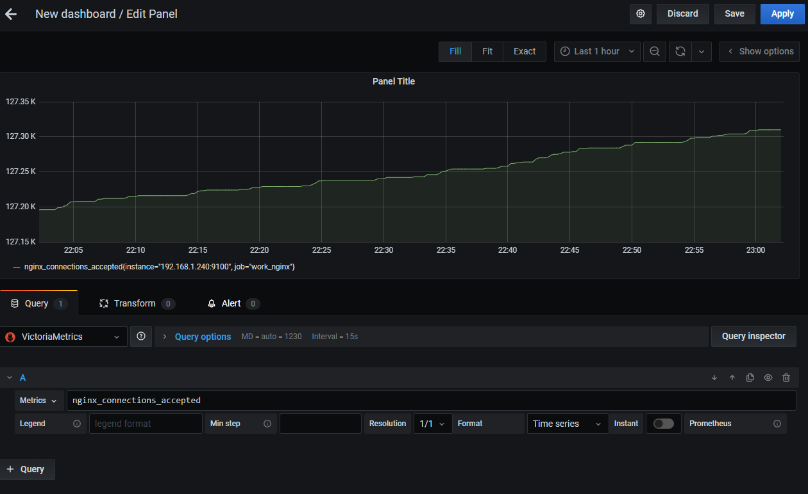

# otus-lab-3
Настройка хранения метрик Prometheus
В прошлом домашнем задании вы развернули prometheus и экспортеры.

Теперь вам предстоит развернуть хранилище метрик для prometheus.

В данном дз предлагается использовать Vikotoria metrics.

Для успешного выполнения дз вам достаточно развернуть один инстанс Viktoria metrics. При это вам нельзя использовать docker образ. Viktoria metrics должна управляться при помощи Systemd.

Далее вам предстоит настроить remote write самого prometheus и подключить новый data source для Grafana.

В качестве результата дз вам нужно приложить часть конфига prometheus с описанием remote write и Systemd unit file для Viktoria metrics в примечание для преподавателя. Так же приложите скриншот дашборда любого экспортера использующий в качестве datasource Viktoria metrics.

Решение задачи.
Используем физическую машину с установленной ос Centos 7.4.
Порядок выполнения.
1. Скачиваем последнюю версию victoria metrics.  
```bash
wget https://github.com/VictoriaMetrics/VictoriaMetrics/releases/download/v1.40.0/victoria-metrics-v1.40.0.tar.gz
```
2. Распаковываем полученный архив.
```bash
tar zxvf victoria-metrics-v1.40.0.tar.gz
```
3. Копируем распакованный файл 
```bash
cp victoria-metrics-prod /usr/local/bin/
```
4. Делаем его исполняемым
```bash
chmod a+x /usr/local/bin/victoria-metrics-prod
```
5. Создаём файл для запуска сервиса 
```bash
vi /etc/systemd/system/victoriametrics.service
```
6. Заносим следующие данные
```bash
[Unit]
Description=VictoriaMetrics
After=network.target

[Service]
Type=simple
StartLimitBurst=5
StartLimitInterval=0
Restart=on-failure
RestartSec=1
PIDFile=/run/victoriametrics/victoriametrics.pid
ExecStart=/usr/local/bin/victoria-metrics-prod -storageDataPath /var/lib/victoria-metrics-data -retentionPeriod 6
ExecStop=/bin/kill -s SIGTERM $MAINPID

[Install]
WantedBy=multi-user.target
```
7. В соответствии с рекомендацией по установке создаём директорию
```bash
mkdir /etc/systemd/system/victoriametrics.service.d
```
8. В этой директории создаём файл ulimit.conf и заполняем его следующими данными
```bash
[Service]
LimitNOFILE=32000
LimitNPROC=32000
```
Для увеличения ограничения открытых файлов и процессов для демона.

9. Просим демона systemd перечитать добавленные(внесённые) изменения.
```bash
systemctl daemon-reload
```
10. Сообщаем системе что демон victoriametrics должен быть запущен при старте системы
```bash
systemctl enable victoriametrics
```
11. Запускаем демона
```bash
systemctl start victoriametrics
```
12. Убеждаемся что демон запущен.
```bash
systemctl status victoriametrics
```
Это подтверждается выводом следующей информации:
```bash
● victoriametrics.service - VictoriaMetrics
   Loaded: loaded (/etc/systemd/system/victoriametrics.service; enabled; vendor preset: disabled)
  Drop-In: /etc/systemd/system/victoriametrics.service.d
           └─ulimit.conf
   Active: active (running) since Mon 2020-08-31 23:14:04 MSK; 1 day 22h ago
 Main PID: 866208 (victoria-metric)
    Tasks: 11 (limit: 23837)
   Memory: 228.0M
   CGroup: /system.slice/victoriametrics.service
           └─866208 /usr/local/bin/victoria-metrics-prod -storageDataPath /var/lib/victoria-metrics-data -retentionPeriod 6

Aug 31 23:14:04 zabbix.strokov.lam victoria-metrics-prod[866208]: 2020-08-31T20:14:04.806Z        info        VictoriaMetrics/app/vmsto>
Aug 31 23:14:04 zabbix.strokov.lam victoria-metrics-prod[866208]: 2020-08-31T20:14:04.808Z        info        VictoriaMetrics/app/vmsel>
Aug 31 23:14:04 zabbix.strokov.lam victoria-metrics-prod[866208]: 2020-08-31T20:14:04.810Z        info        VictoriaMetrics/app/vmsel>
Aug 31 23:14:04 zabbix.strokov.lam victoria-metrics-prod[866208]: 2020-08-31T20:14:04.810Z        info        VictoriaMetrics/app/victo>
Aug 31 23:14:04 zabbix.strokov.lam victoria-metrics-prod[866208]: 2020-08-31T20:14:04.811Z        info        VictoriaMetrics/lib/https>
Aug 31 23:14:04 zabbix.strokov.lam victoria-metrics-prod[866208]: 2020-08-31T20:14:04.811Z        info        VictoriaMetrics/lib/https>
Aug 31 23:14:04 zabbix.strokov.lam victoria-metrics-prod[866208]: 2020-08-31T20:14:04.918Z        info        VictoriaMetrics/lib/stora>
Aug 31 23:14:04 zabbix.strokov.lam victoria-metrics-prod[866208]: 2020-08-31T20:14:04.924Z        info        VictoriaMetrics/lib/stora>
Sep 01 03:00:04 zabbix.strokov.lam victoria-metrics-prod[866208]: 2020-09-01T00:00:04.951Z        info        VictoriaMetrics/lib/stora>
Sep 01 03:00:04 zabbix.strokov.lam victoria-metrics-prod[866208]: 2020-09-01T00:00:04.956Z        info        VictoriaMetrics/lib/stora>
```
13. Рассказываем ранее установленному prometheus что у него появилась подружка, с которой он может делиться информацией. Для этого в файл /etc/prometheus/prometheus.yml добавляем строчки  
```bash
remote_write:
  - url: http://localhost:8428/api/v1/write
```
14. Просим prometheus перегрузиться и перечитать конфигурацию.
```bash
systemctl restart prometheus
```
15. Открываем порт victoriametrics для доступа с других узлов (опционально)  
```bash
firewall-cmd --zone=public --permanent --add-port 8428/tcp
firewall-cmd --reload
```
16. Смотрим что имеем в victoria metrics. В браузере переходим по ссылке http://zabbix.strokov.lan:8428/metrics
И получаем что-то вида ....
```plaintext
vm_active_merges{type="indexdb"} 0
vm_active_merges{type="storage/big"} 0
vm_active_merges{type="storage/small"} 0
vm_assisted_merges_total{type="indexdb"} 0
vm_assisted_merges_total{type="storage/small"} 0
vm_blocks{type="indexdb"} 5
vm_blocks{type="storage/big"} 0
vm_blocks{type="storage/small"} 7180
vm_cache_collisions_total{type="storage/metricName"} 0
vm_cache_collisions_total{type="storage/tsid"} 0
vm_cache_entries{type="indexdb/dataBlocks"} 3
vm_cache_entries{type="indexdb/indexBlocks"} 2
vm_cache_entries{type="indexdb/tagFilters"} 199
vm_cache_entries{type="indexdb/uselessTagFilters"} 0
vm_cache_entries{type="promql/parse"} 16
vm_cache_entries{type="promql/regexp"} 4
vm_cache_entries{type="promql/rollupResult"} 0
vm_cache_entries{type="storage/bigIndexBlocks"} 0
vm_cache_entries{type="storage/date_metricID"} 430
vm_cache_entries{type="storage/hour_metric_ids"} 466
vm_cache_entries{type="storage/metricIDs"} 0
vm_cache_entries{type="storage/metricName"} 24
...........
```
Метрики попали в базу и готовы к просмотру.

17. Переходим в grafana. Добавляем новый источник данных в Configuration->DataSources  
Имя VictoriaMetrics
URL http://zabbix.strokov.lan:8428

18. Создаём новую панель в grafana. В качестве источника данных устанавливаем VictoriaMetrics  
Для проверки работы выбираем метрику nginx_connections_accepted
Смотрим что получилось, делаем скриншот и прикладываем в качестве результата выполнения задачи.




